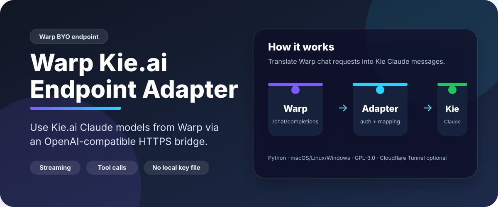

# Warp Kie.ai Endpoint Adapter


A local OpenAI-compatible HTTPS adapter that lets Warp use Kie.ai Claude models through `/v1/chat/completions`.

Warp sends requests to OpenAI-compatible custom endpoints. Kie Claude models use the Anthropic-style `/claude/v1/messages` API. This adapter translates chat requests, streaming responses, Kie/Warp model ID compatibility, and compatible OpenAI-style tool calls between those formats.

## Key points
- No local Kie API key file is required.
- Warp stores your Kie API key as the custom endpoint API key.
- The adapter forwards Warp's inbound `Authorization: Bearer <KIE_API_KEY>` token to Kie per request.
- `/v1/healthz` and `/v1/models` are public.
- `/v1/chat/completions` requires bearer auth.
- Current logs avoid request prompts, tool arguments, bearer tokens, and upstream request bodies.

## Current limitations
The adapter currently works best for text responses. It can answer questions, explain code, produce commands as text, and generate snippets, diffs, or file contents for a human or another agent to apply.

It does not currently give Kie Claude automatic access to Warp's terminal or local filesystem. Claude-native tools such as `Bash`, `Read`, `Write`, `Edit`, `MultiEdit`, `Grep`, `Glob`, and `LS` are not executed through Warp by this adapter.

When Kie Claude tries to call one of those unsupported native tools, the adapter suppresses the tool call and retries the request with a text-only fallback so Warp does not abort with an unknown native tool error.

OpenAI-style tool calls can only be passed through when the model uses a tool name that Warp provided in the request and the arguments match that tool's schema. Mapping Claude-native tools to Warp tools may be possible in the future after safely inspecting Warp's provided tool schemas.

## Requirements
- Python 3.10 or newer.
- OpenSSL for generating the local HTTPS certificate.
- Cloudflare Tunnel is optional, but recommended when Warp cannot use `localhost`, IP addresses, or plain HTTP.
- A Kie API key configured in Warp as the custom endpoint API key.

The installers check for required packages and install what they can. Cloudflare Tunnel is bundled into the installation folder when tunnel support is selected.

## Docker
Docker Desktop and Docker Compose are supported.
For the easiest setup, use the Docker quick-start scripts. They check whether Docker, the Docker daemon, and Docker Compose are available before building anything, then print the Warp settings after startup.

macOS/Linux:

```bash
./docker/docker-quick-start.sh start
```

Windows PowerShell:

```powershell
.\docker\docker-quick-start.ps1 start
```

The default Docker mode starts the adapter plus a Cloudflare quick-tunnel sidecar, which is the most useful setup when Warp needs a public HTTPS Base URL. The current tunnel URL is saved to:

```text
docker-data/tunnel_url.txt
```

See [Docker Quick Start Guide](docker/QUICK_START.md) for a beginner-friendly walkthrough, dependency guidance, Warp setup, lifecycle commands, and troubleshooting.

Run only the local adapter on a non-default host port:

```bash
./docker/docker-quick-start.sh adapter
```

Test the local adapter:

```bash
./docker/docker-quick-start.sh test
```

Stop the containers:

```bash
./docker/docker-quick-start.sh stop
```

Plain Docker Compose commands are also supported from the repository root:

```bash
ADAPTER_HOST_PORT=8788 docker compose --profile tunnel up --build -d
ADAPTER_HOST_PORT=8788 docker compose --profile tunnel ps
ADAPTER_HOST_PORT=8788 docker compose --profile tunnel down
```

See [docker/README.md](docker/README.md) for Docker-specific details.

## Installers
The installers allow you to choose:
- installation directory,
- manual launch or service mode,
- which service components to install: `adapter`, `tunnel`, or `both`.

If the tunnel is installed as a service, the current quick-tunnel URL is saved to `tunnel_url.txt` in the installed folder.

### macOS
Interactive install:

```bash
./installers/install-macos.sh
```

Non-interactive manual install:

```bash
./installers/install-macos.sh --yes --mode manual --components both
```

Install both adapter and tunnel as user LaunchAgents:

```bash
./installers/install-macos.sh --yes --mode service --components both
```

### Linux
Interactive install:

```bash
./installers/install-linux.sh
```

Install both adapter and tunnel as systemd user services:

```bash
./installers/install-linux.sh --yes --mode service --components both
```

For services to start before interactive login on systemd systems, run this after installation if desired:

```bash
sudo loginctl enable-linger "$USER"
```

### Windows
Run PowerShell as the target user:

```powershell
Set-ExecutionPolicy -Scope Process Bypass
.\installers\install-windows.ps1
```

Non-interactive manual install:

```powershell
.\installers\install-windows.ps1 -Yes -Mode manual -Components both
```

Install both adapter and tunnel as logon Scheduled Tasks:

```powershell
.\installers\install-windows.ps1 -Yes -Mode service -Components both
```

## Manual usage after installation
macOS/Linux:

```bash
cd ~/.local/share/warp-kie-adapter
./adapterctl.sh models
./adapterctl.sh start
./adapterctl.sh connection
./adapterctl.sh stop
```

Windows:

```powershell
cd "$env:LOCALAPPDATA\warp-kie-adapter"
./adapterctl.ps1 models
./adapterctl.ps1 start
./adapterctl.ps1 connection
./adapterctl.ps1 stop
```

## Service usage after installation
macOS service files are installed under:

```text
~/Library/LaunchAgents/dev.warp-kie-adapter.adapter.plist
~/Library/LaunchAgents/dev.warp-kie-adapter.tunnel.plist
```

Linux service files are installed under:

```text
~/.config/systemd/user/warp-kie-adapter.service
~/.config/systemd/user/warp-kie-adapter-tunnel.service
```

Windows service-like startup uses Scheduled Tasks:

```text
WarpKieAdapter-Adapter
WarpKieAdapter-Tunnel
```

For tunnel service installs, read the active public URL from:

```text
<install-dir>/tunnel_url.txt
```

## Warp settings
Use the values printed by `adapterctl` or read the tunnel URL file.

- API type/provider: OpenAI-compatible custom endpoint
- Base URL: `https://<current-trycloudflare-host>/v1`
- API key: your Kie API key
- Custom headers: none
- Recommended model ID: `claude-opus-4-8`

Run `./adapterctl.sh models` on macOS/Linux or `./adapterctl.ps1 models` on Windows to print the full list of model IDs and aliases accepted by the adapter. This command reads the adapter's local static catalog, so it does not require the adapter to be running and does not require a local Kie API key file. Warp still stores and sends your Kie API key for actual chat requests.

Leave Warp credit fallback disabled if you want endpoint failures to remain visible instead of being retried against another Warp model.

## Supported Claude model mapping
Direct Kie Claude model IDs pass through unchanged:

- `claude-opus-4-8`
- `claude-opus-4-7`
- `claude-opus-4-6`
- `claude-opus-4-5`
- `claude-sonnet-4-6`
- `claude-sonnet-4-5`
- `claude-haiku-4-5`

Known Warp model IDs are mapped to the matching Kie model for compatibility:
- `claude-4-7-opus-xhigh`, `claude-4-7-opus-high`, `claude-4-7-opus-max` → `claude-opus-4-7`
- `claude-4-6-opus-high`, `claude-4-6-opus-max` → `claude-opus-4-6`
- `claude-4-6-sonnet-high`, `claude-4-6-sonnet-max` → `claude-sonnet-4-6`
- `claude-4-5-opus`, `claude-4-5-opus-thinking` → `claude-opus-4-5`
- `claude-4-5-sonnet`, `claude-4-5-sonnet-thinking` → `claude-sonnet-4-5`
- `claude-4-5-haiku` → `claude-haiku-4-5`

Unknown `claude-*` IDs are forwarded as-is. If Kie does not support the model, Kie returns the upstream error.

## GPT / ChatGPT models through Kie
This project adapts Claude only.

- Kie GPT 5.2 uses an OpenAI-style chat completions endpoint: `https://api.kie.ai/gpt-5-2/v1/chat/completions`. In Warp, try it directly with base URL `https://api.kie.ai/gpt-5-2/v1` and model `gpt-5-2`.
- Kie GPT 5.4 and GPT 5.5 use the responses endpoint `https://api.kie.ai/codex/v1/responses`, not `/chat/completions`. If Warp only calls `/chat/completions` for custom OpenAI-compatible endpoints, those models need a separate responses-to-chat adapter.

## Files
- `adapter.py`: OpenAI-compatible HTTPS server and Kie Claude translator.
- `adapterctl.sh`: macOS/Linux controller for adapter and tunnel.
- `adapterctl.ps1`: Windows controller for adapter and tunnel.
- `start_adapter.sh`: macOS/Linux foreground adapter launcher.
- `make_https_cert.sh`: macOS/Linux self-signed certificate generator.
- `docker/docker-quick-start.sh`: macOS/Linux Docker helper for dependency checks and Compose lifecycle.
- `docker/docker-quick-start.ps1`: Windows PowerShell Docker helper for dependency checks and Compose lifecycle.
- `scripts/tunnel_service.py`: foreground Cloudflare Tunnel wrapper that saves `tunnel_url.txt`.
- `scripts/*.ps1`: Windows certificate, adapter, and tunnel helpers.
- `installers/`: macOS, Linux, and Windows installers.

## Logs and safety
Current structured adapter logs avoid request prompts, tool arguments, and secrets. The inbound Warp bearer token is never logged.

Runtime files are ignored by git:
- `adapter.log`
- `cloudflared.log`
- `adapter.pid`
- `cloudflared.pid`
- `tunnel_url.txt`
- generated `certs/`
- optional bundled `bin/cloudflared*`
- Docker tunnel state in `docker-data/`

The Cloudflare quick tunnel URL is public, but chat requests require a bearer token and Kie rejects invalid keys. Do not publish your Kie key.

## Troubleshooting
- If Warp times out, confirm Warp credit fallback is disabled and check `adapterctl status`.
- If the Base URL stops working, restart the tunnel; quick tunnel URLs can change.
- If the tunnel is a service, read the current URL from `tunnel_url.txt`.
- If the adapter does not start, check that port `8787` is free.
- If a Claude model fails, test with `claude-opus-4-8` first, then check whether Kie supports the requested model ID.
- If a service does not start, run the same component manually from the installed folder to see the error directly.

## License
This project is licensed under GPL-3.0. See [LICENSE](LICENSE).
